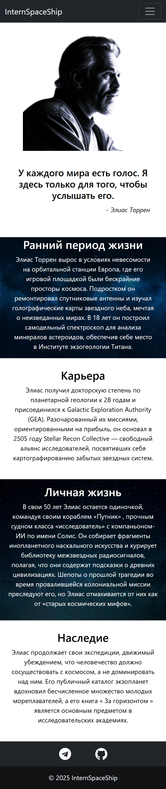
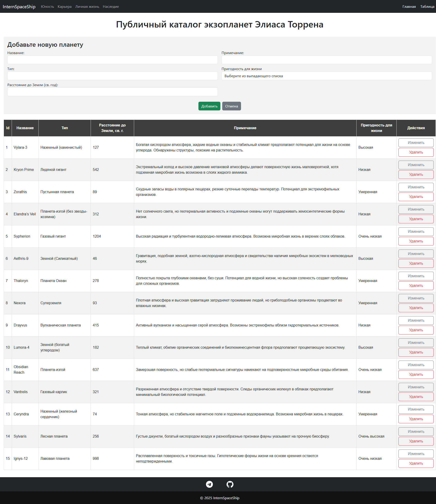
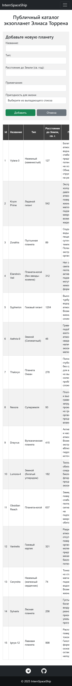

# Сайт космического путешественника
Проект разработан в рамках стажировки во время обучения на Цифровых кафедрах на базе Самарского университета. Сайт состоит из двух страниц и посвящен деятельности вымышленного космического путешественника.
На первой странице представлена биография путешественника, а на второй - таблица, представляющая из себя перечень открытых планет. В таблице реализована возможность выполнения CRUD операций с внесением изменений в базу данных. Сайт также адаптирован для просмотра с мобильных устройств.

## Стек

HTML, CSS, Javascript, React, Bootstrap

## Запуск проекта

Для запуска сервера необходимо в корневой папке сервера выполнить команду:

### `npm start`

Или в корневой папке клиентской части выполнить команду:

### `npm start-server`

Для запуска клиентской части необходимо в корневой папке клиентской части выполнить команду:

### `npm start`

## Демонстрационные изображения

<table>
  <tr>
    <td valign="top" align="center">
      Отображение десктоп
    </td>
    <td valign="top" align="center">
     Отображение для мобильных устройств
    </td>
  </tr>
  <tr>
    <td valign="top" align="center">
      
    </td>
    <td valign="top" align="center">
      
    </td>
  </tr>
  <tr>
    <td valign="top" align="center">
      
    </td>
    <td valign="top" align="center">
      
    </td>
  </tr>
</table>
  
